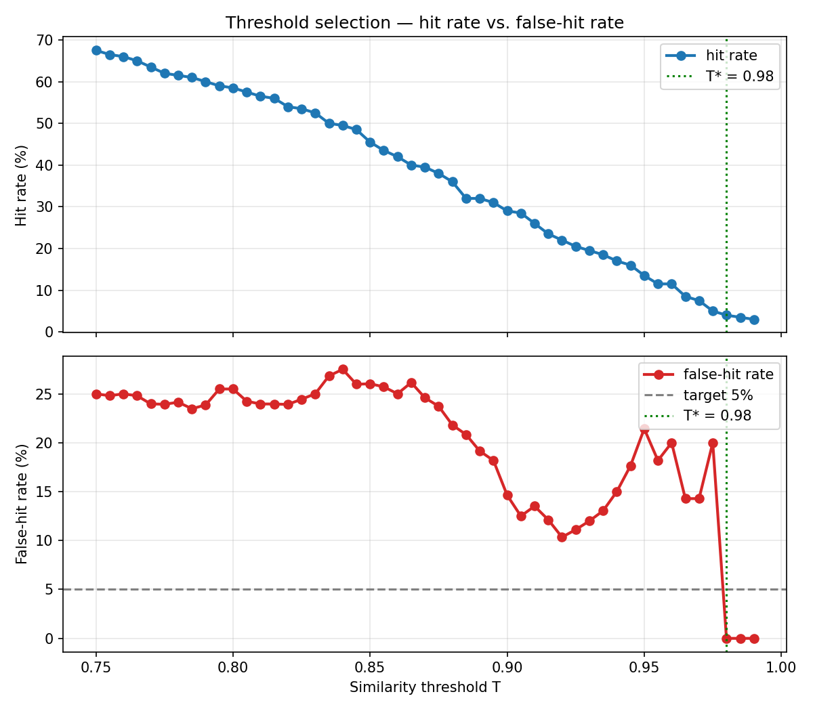

<div align="center">


# llmrouter

---

**LLM inference gateway with semantic caching and cost-aware routing**

An LLM inference gateway in Go with semantic response caching, cost-aware model routing, streaming support, and a full observability suite.

</div>

I document what I learn from each pull request in [**LEARNINGS.md**](./LEARNINGS.md).

---

## What llmrouter does

**Cuts LLM API cost by 20.4% while preserving 94.5% of end-user response quality** on a 199-prompt realistic-distribution benchmark. llmrouter sits in front of Anthropic Claude and Google Gemini behind a unified OpenAI-compatible endpoint, and:

- **Caches semantically similar responses** — in-process ONNX embeddings + Redis cosine similarity search. Paraphrased and repeat prompts return in ~52ms p50, roughly 28× faster than a fresh model call.
- **Routes by prompt complexity** — a gradient-boosted classifier scores each prompt and sends easy ones to a cheap model, hard ones to the expensive model.
- **Streams tokens end-to-end** — tee pattern writes through to cache while delivering SSE to the client.
- **Emits full observability** — 17 Prometheus collectors covering request rate, TTFT, inter-token latency, cache hit ratio, and per-model cost, with a 13-panel Grafana dashboard out of the box.

---

## Architecture


**Request lifecycle:**
1. Client sends a request to the unified `/v1/chat/completions` endpoint.
2. Embedder computes a 384-dim embedding of the prompt via in-process ONNX inference.
3. Cache layer searches Redis for semantically similar cached responses (SIMD-accelerated cosine similarity).
4. **Cache hit** → return stored response immediately.
5. **Cache miss** → complexity classifier scores the prompt and selects a cheap or expensive model within the target provider.
6. Provider adapter translates the request and streams the response to the client while buffering for cache write.
7. Metrics emitted at every stage.

## Benchmarks

> **20.4% cost reduction at 94.5% quality preservation** on a 199-prompt realistic-distribution corpus.

### Setup

| | |
|---|---|
| Corpus | 199 prompts across 104 clusters; QQP-derived paraphrases with a power-law cluster-size distribution to mimic real workloads (some questions repeat heavily, others are unique) |
| Cache threshold | Cosine similarity `T = 0.92` (chosen via [Parameter tuning](#parameter-tuning)) |
| Complexity threshold | `0.28`, F2-tuned (chosen via [Parameter tuning](#parameter-tuning)) |
| Run | `model="auto"`, `concurrency=3`, single 199-request pass via `make bench-collect`, gateway running locally with Redis |

### Cost savings

| Metric | Value |
|---|--:|
| Actual cost (199 requests) | $0.69 |
| Saved by cache | $0.12 |
| Saved by cheap-routing | ~$0.06 |
| **Total saved** | **~$0.18** |
| **Savings rate (vs naive baseline)** | **20.4%** |

Naive baseline = every request routed to the quality model with no cache. Sonnet handled 148 misses ($0.66), Haiku handled 22 ($0.03) — cheap-routing absorbed ~13% of misses.

### Latency

| Path | p50 | p95 | p99 | p50 TTFT |
|---|--:|--:|--:|--:|
| Cache hit | 52ms | 67ms | 67ms | 52ms |
| Cache miss | 8.65s | 11.31s | 14.46s | 1.47s |

Cache hits return tokens **~28× faster** to first byte than misses (52ms vs 1.47s p50 TTFT).

### Quality preservation

Methodology: Gemini 2.5 Pro judges each cache-hit and cheap-routed-miss response against a freshly-generated baseline from the quality model (Sonnet). Quality-routed misses are skipped — same model as baseline, so judging them would just measure LLM stochasticity.

| Path | Count | Adequate | Rate |
|---|--:|--:|--:|
| Cache hit | 29 | 24 | 82.8% |
| Cheap-routed miss | 22 | 16 | 72.7% |
| Quality-routed miss | 148 | 148 | 100%* |
| **Total** | **199** | **188** | **94.5%** |

*\*Quality-routed misses are preserved by definition — the gateway routed to the baseline model.*

- **End-user metric: 94.5%** — across all 199 requests, the user got an adequate answer 94.5% of the time.
- **Engineering metric: 78.4%** — of the 51 *affected* requests (cache hits + cheap-routes), 40 were judged adequate. The more rigorous segmentation.

## Parameter tuning

Two thresholds calibrated against quality-labeled data: cache similarity and complexity classifier output.

### Cache similarity threshold

Trade-off: too low → false hits (cached responses served for prompts they don't answer); too high → cache is useless.

**Method:** offline hit-rate sweep over `T ∈ [0.75, 0.99]`; live hit collection at `T=0.75` (hits at stricter T are a subset, so one run covers all candidates); Gemini 2.5 Pro labels each `(cached, fresh-baseline)` pair on an intrinsic adequacy rubric; pick the lowest T meeting the target false-hit rate (FHR).

**Result:** `T* = 0.92` at ~10% FHR.



Original target was 5% FHR — unreachable on this corpus. Only `T ≥ 0.98` cleared 5%, where hit rate collapsed to ~3% (cache provides no value). Renegotiated to ~10% FHR at `T = 0.92` for a ~22% hit rate. Tradeoff: ~1 in 10 cache hits is inadequate.

### Complexity classifier

Binary signal: does this prompt need the expensive model? Trained on 2,499 prompts across 8 sources (Dolly, OpenAssistant, MMLU, HumanEval, MBPP, GSM8K, ARC Challenge, Alpaca), labeled by Gemini 2.5 Pro. Distribution: 79.1% adequate / 20.9% needs-expensive (4:1 imbalance, 79.2% majority-class baseline).

**MLP dead end.** A PyTorch MLP (384→64→32→1) never learned across multiple architectures — always collapsed to predicting all-adequate. 27K parameters on noisy-labeled data without the axis-aligned-split inductive bias that makes tree models work on tabular data.

**Gradient-boosted trees.** Three deliberate choices:

- **Class weighting** — 4× `sample_weight` on the minority class moved recall on label=1 from 3% to 91.3%. The biggest single lever.
- **F2 over F1** — catching expensive prompts (recall) matters more than avoiding false alarms (precision); F2 weights recall 2× over precision.
- **Handcrafted features (negative result)** — 6 task-structure features (subtask count, constraint count, etc.) showed 0% importance alongside embeddings; below-random when used alone. Dropped.

A grid search over 4 GBT configs scored within 0.01 F2 of each other — bottleneck is signal in the data, not model capacity.

**Final model:** GBT, 100 trees, depth 5, `lr=0.1`, 4× class weight, threshold 0.28.

| Metric | Value |
|---|--:|
| Recall on label=1 | 91.3% |
| Precision on label=1 | 25% |
| Adequate-correct at threshold | 28% |

Conservative quality-first router: rarely serves an inadequate response, overspends on ~2/3 of easy prompts. The cache absorbs some of the over-routing on near-duplicates.

## Quick Start

Start the local stack (Redis + Prometheus + Grafana):
```bash
docker-compose up -d
```

Run the gateway:
```bash
go run ./cmd/llmrouter
```

Send a request:
```bash
curl -N -X POST http://localhost:8080/v1/chat/completions \
  -H 'Content-Type: application/json' \
  -d '{"model":"auto","messages":[{"role":"user","content":"Explain TCP handshake"}],"stream":true}'
```

## API

| Method | Endpoint                | Description                          |
| ------ | ----------------------- | ------------------------------------ |
| POST   | /v1/chat/completions    | Chat completions (OpenAI-compatible) |
| GET    | /health                 | Liveness check + provider status     |
| GET    | /metrics                | Prometheus scrape target             |
| GET    | /cache/stats            | Cache hit rate, entry count          |
| POST   | /cache/flush            | Invalidate all cached entries        |

## Build & Test

```bash
go build ./cmd/llmrouter    # build
go test ./...               # test
golangci-lint run           # lint
```

## Observability

```bash
docker-compose up -d
```

- Gateway: http://localhost:8080
- Prometheus: http://localhost:9090
- Grafana: http://localhost:3000
