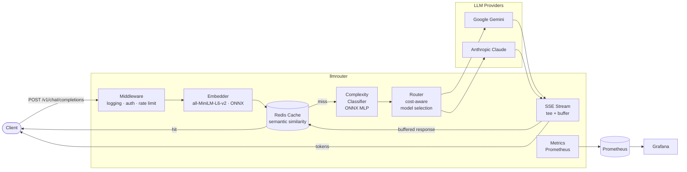

# llmrouter


An LLM inference gateway in Go with semantic response caching, cost-aware model routing, and token-level streaming observability.

I document what I learn from each pull request in [**LEARNINGS.md**](./LEARNINGS.md).

**Status:** In progress. Core gateway, provider adapters, streaming, embedder, and semantic cache layer are implemented. Up next: cache integration into the request lifecycle, complexity classifier, and full Prometheus instrumentation.

---

## Architecture



**Request lifecycle:**
1. Client sends a request to the unified `/v1/chat/completions` endpoint.
2. Embedder computes a 384-dim embedding of the prompt via in-process ONNX inference.
3. Cache layer searches Redis for semantically similar cached responses (SIMD-accelerated cosine similarity).
4. **Cache hit** → return stored response immediately.
5. **Cache miss** → complexity classifier scores the prompt → router selects provider/model → adapter translates the request → streams response to client while buffering for cache write.
6. Metrics emitted at every stage.

---

## At a glance

- Reverse proxy for Google Gemini and Anthropic behind a unified `/v1/chat/completions` endpoint.
- Semantic cache: embeds prompts via `all-MiniLM-L6-v2` (ONNX, in-process), stores in Redis, and returns cached responses for semantically similar queries.
- Cost-aware router: an ONNX complexity classifier scores prompts and routes simple ones to cheap models, complex ones to capable models.
- Full SSE streaming with tee-based cache write-through — tokens stream to the client while buffering for cache storage.
- Prometheus metrics: request rates, TTFT, inter-token latency, cache hit ratio, cost tracking, routing decisions.

## Quick Start

Start the local stack (Redis + Prometheus + Grafana):
```bash
docker-compose up -d
```

Run the gateway:
```bash
go run ./cmd/llmrouter
```

Send a request:
```bash
curl -N -X POST http://localhost:8080/v1/chat/completions \
  -H 'Content-Type: application/json' \
  -d '{"model":"auto","messages":[{"role":"user","content":"Explain TCP handshake"}],"stream":true}'
```

## API

| Method | Endpoint                | Description                          |
| ------ | ----------------------- | ------------------------------------ |
| POST   | /v1/chat/completions    | Chat completions (OpenAI-compatible) |
| GET    | /health                 | Liveness check + provider status     |
| GET    | /metrics                | Prometheus scrape target             |
| GET    | /cache/stats            | Cache hit rate, entry count          |
| POST   | /cache/flush            | Invalidate all cached entries        |

## Build & Test

```bash
go build ./cmd/llmrouter    # build
go test ./...               # test
golangci-lint run           # lint
```

## Observability

```bash
docker-compose up -d
```

- Gateway: http://localhost:8080
- Prometheus: http://localhost:9090
- Grafana: http://localhost:3000
