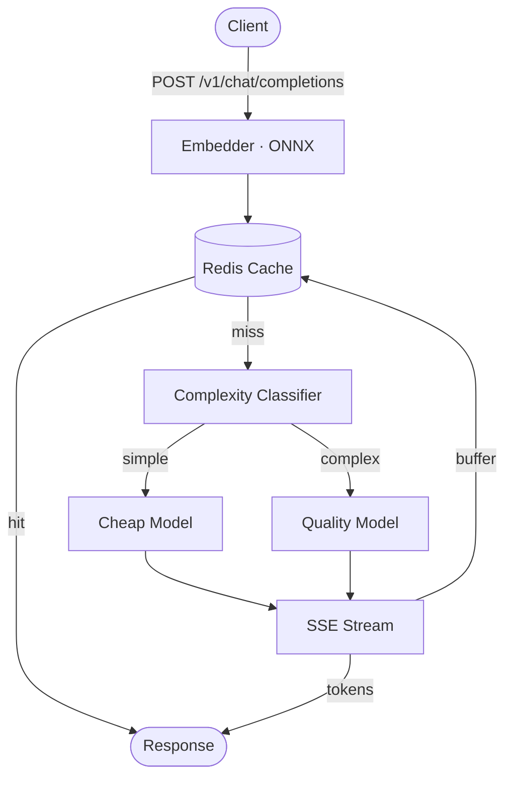
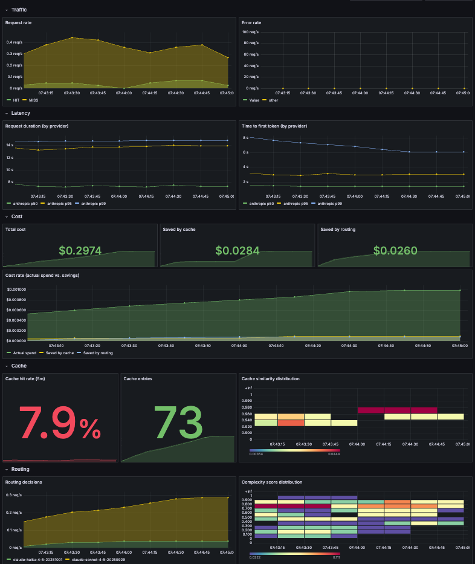

<div align="center">


# llmrouter

**LLM inference gateway with semantic caching and cost-aware routing**

An LLM inference gateway in Go with semantic response caching, cost-aware model routing, streaming support, and a full observability suite.

</div>

👉 I document what I learn from each pull request in [**LEARNINGS.md**](./LEARNINGS.md).

---

## What llmrouter does

**Cuts LLM API cost by 20.4% while preserving 94.5% of end-user response quality** on a 199-prompt realistic-distribution benchmark. llmrouter sits in front of Anthropic Claude and Google Gemini behind a unified OpenAI-compatible endpoint, and:

- **Routes by prompt complexity** — a gradient-boosted classifier scores each prompt and sends easy ones to a cheap model, hard ones to the expensive model.
- **Caches semantically similar responses** — in-process ONNX embeddings + Redis cosine similarity search. Paraphrased and repeat prompts return in 52ms p50, 28× faster than a fresh model call.
- **Streams tokens end-to-end** — tee pattern writes through to cache while delivering SSE to the client.
- **Emits full observability** — 17 Prometheus collectors covering request rate, TTFT, inter-token latency, cache hit ratio, and per-model cost, with a 13-panel Grafana dashboard out of the box.

---

## Architecture



**Request lifecycle:**
1. Client sends a request to the unified `/v1/chat/completions` endpoint.
2. Embedder computes a 384-dim embedding of the prompt via in-process ONNX inference.
3. Cache layer searches Redis for semantically similar cached responses (SIMD-accelerated cosine similarity).
4. **Cache hit** → return stored response immediately.
5. **Cache miss** → complexity classifier scores the prompt and selects a cheap or expensive model within the target provider.
6. Provider adapter translates the request and streams the response to the client while buffering for cache write.
7. Metrics emitted at every stage.

## Benchmarks

> **20.4% cost reduction at 94.5% quality preservation** on a 199-prompt realistic-distribution corpus.

### Setup

| | |
|---|---|
| Corpus | 199 prompts across 104 clusters; QQP-derived paraphrases with a power-law cluster-size distribution to mimic real workloads (some questions repeat heavily, others are unique) |
| Cache threshold | Cosine similarity `T = 0.92` (chosen via [Training & Tuning](./TRAINING_AND_TUNING.md#cache-similarity-threshold)) |
| Complexity threshold | `0.28`, F2-tuned (chosen via [Training & Tuning](./TRAINING_AND_TUNING.md#complexity-classifier)) |

### Cost savings

| Metric | Value |
|---|--:|
| Actual cost (199 requests) | $0.69 |
| Saved by cache | $0.12 |
| Saved by cheap-routing | $0.06 |
| **Total saved** | **$0.18** |
| **Savings rate (vs naive baseline)** | **20.4%** |

Naive baseline = every request routed to the quality model with no cache. Sonnet handled 148 misses ($0.66), Haiku handled 22 ($0.03) — cheap-routing absorbed 13% of misses.

### Quality preservation

Methodology: Gemini 2.5 Pro judges each cache-hit and cheap-routed-miss response against a freshly-generated baseline from the quality model (Sonnet). Quality-routed misses are skipped — same model as baseline, so judging them would just measure LLM stochasticity.

| Path | Count | Adequate | Rate |
|---|--:|--:|--:|
| Cache hit | 29 | 24 | 82.8% |
| Cheap-routed miss | 22 | 16 | 72.7% |
| Quality-routed miss | 148 | 148 | 100%* |
| **Total** | **199** | **188** | **94.5%** |

*\*Quality-routed misses are preserved by definition — the gateway routed to the baseline model.*

Full methodology behind both thresholds: [TRAINING\_AND\_TUNING.md](./TRAINING_AND_TUNING.md).

## Observability

llmrouter ships with a 17-collector Prometheus suite and a 13-panel Grafana dashboard preprovisioned via `docker-compose`. Bring up the local stack and the dashboard is live with no extra setup.

```bash
docker-compose up -d
```

| Service    | URL                   |
|------------|-----------------------|
| Gateway    | http://localhost:8080 |
| Prometheus | http://localhost:9090 |
| Grafana    | http://localhost:3000 |

**Metric coverage:**

- **Request flow** — request rate, duration, and error counts by provider and error type.
- **Streaming** — time-to-first-token, inter-token latency, prompt and completion token counts.
- **Cost** — per-request and cumulative cost by provider and model, plus separate cache and routing savings counters so each lever can be attributed independently.
- **Cache** — similarity score histogram, entry count, hit/miss/skip status (hit rate derived in PromQL).
- **Routing** — decision counts by strategy and selected model, classifier complexity score distribution.
- **Inference** — embedding and classification durations.



## Quick Start

Set provider API keys (both required for `model="auto"` routing):
```bash
export GOOGLE_API_KEY=...      # https://aistudio.google.com/apikey
export ANTHROPIC_API_KEY=...   # https://console.anthropic.com/settings/keys
```

Start the gateway. `make run` boots the Docker stack (Redis + Prometheus + Grafana) and the Go gateway in one step:
```bash
make run    # gateway on :8080, metrics scraped at :9090
```

Send a streaming request:
```bash
curl -N -X POST http://localhost:8080/v1/chat/completions \
  -H 'Content-Type: application/json' \
  -d '{"model":"auto","messages":[{"role":"user","content":"Explain TCP handshake"}],"stream":true}'
```

Open the Grafana dashboard at [http://localhost:3000/dashboards](http://localhost:3000/dashboards) — anonymous admin access is enabled, no login required. The `llmrouter` dashboard is auto-provisioned from [grafana/dashboards/](grafana/dashboards/) and updates as soon as traffic hits the gateway.

## API

| Method | Endpoint               | Description                                                        |
| ------ | ---------------------- | ------------------------------------------------------------------ |
| POST   | `/v1/chat/completions` | Chat completions (OpenAI-compatible, streaming and non-streaming). |
| GET    | `/health`              | Process liveness probe.                                            |
| GET    | `/metrics`             | Prometheus scrape target.                                          |
| GET    | `/cache/stats`         | Hit/miss counters, entry count, average similarity.                |
| POST   | `/cache/flush`         | Drop all cached entries and reset counters.                        |

### `POST /v1/chat/completions`

The primary endpoint. Accepts an OpenAI-compatible JSON body and returns either a single JSON object or a Server-Sent Events stream of OpenAI `ChatCompletionChunk`s, depending on `stream`.

#### Request body

```json
{
  "model": "auto",
  "messages": [
    {"role": "user", "content": "Explain TCP handshake"}
  ],
  "stream": true,
  "max_tokens": 1024
}
```

**`model`** (string, required) — Either a registered model name (e.g. `gemini-2.0-flash`, `claude-sonnet-4-5-20250929`) or the literal `"auto"`. When `"auto"`, llmrouter computes a complexity score for the prompt and picks `cheap_model` or `quality_model` from the routing config based on `complexity_threshold`. Pinning a concrete model skips routing entirely; the cache is still consulted if enabled.

**`messages`** (array, required) — Standard OpenAI message list. Each entry has `role` (`"system"`, `"user"`, or `"assistant"`) and `content` (plain text). At least one `user` message is required, otherwise the gateway returns 400. Only the **last user message** is used for embedding and cache lookup — embedding the full conversation causes spurious misses on minor prefix changes.

**`stream`** (bool, optional, default `false`) — When `true`, the response is an SSE stream. When `false` or omitted, the response is a single JSON object.

**`max_tokens`** (int, optional) — Forwarded to the upstream provider unchanged. Anthropic's API requires this field; Google's does not. llmrouter does not enforce it.

Unknown JSON fields are silently dropped. Sampling parameters like `temperature`, `top_p`, `frequency_penalty`, and `stop` are not currently plumbed through — sending them is harmless but they have no effect.

#### Request headers

All optional. These control infrastructure behavior, not model parameters.

**`X-Cache`** — `auto` (default), `skip`, or `only`.
- `auto` — look up on read, store on write.
- `skip` — bypass the cache entirely; always call the provider, do not write the result back.
- `only` — lookup-only mode. On a cache miss, the gateway returns `404 Not Found` with `{"error": "cache miss (x-cache: only)"}` instead of calling the provider. Used by the bench harness for hit-only replay.

**`X-Route`** — `auto`, `cheapest`, or `quality`. Overrides `routing.default_strategy` from config. Only valid when `model="auto"`. Unknown values return 400; sending this header with a pinned model also returns 400 (rather than silently no-op'ing).

**`X-Provider`** — `google`, `anthropic`, etc. Overrides `routing.default_provider` from config. Only valid when `model="auto"`. Unknown providers return 400; sending this header with a pinned model also returns 400.

#### Response headers

Set on every successful response (streaming and non-streaming, hits and misses):

- **`X-LLMRouter-Cache`** — `HIT` or `MISS`.
- **`X-LLMRouter-Provider`** — `google`, `anthropic`, etc. On cache hits, this is the provider that originally generated the cached response.
- **`X-LLMRouter-Model`** — actual model used. After auto-routing, this reflects the routed-to model.
- **`X-LLMRouter-Similarity`** — only on cache hits. Cosine similarity of the matched entry, formatted to four decimal places (e.g. `0.9542`).


## Build & Test

```bash
make build        # compile the gateway binary
make test         # unit tests with race detector
make lint         # golangci-lint
```

The unit tests cover provider adapters, semantic cache, embedder, router, and streaming — no live API calls required, no running gateway.

The bench harness is a separate Go test with a `bench` build tag, and runs against a live gateway:

```bash
make run          # start the gateway (separate terminal)
make bench        # 199-prompt realistic corpus — prints hit rate, cost saved, latency percentiles
```

`make bench-collect` extends the run to also issue baseline calls on cache hits and cheap-routed misses for quality evaluation (costs ~$1.50–3 in API calls). `make bench-quality` then judges the collected records with Gemini 2.5 Pro and reports per-path quality preservation.
